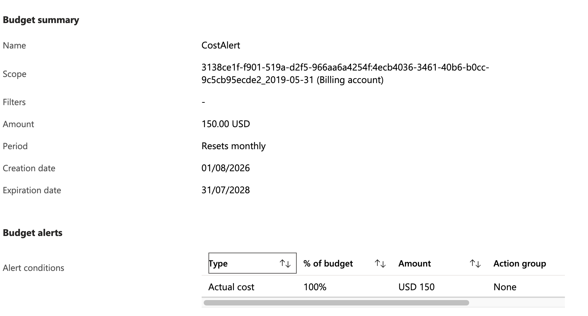
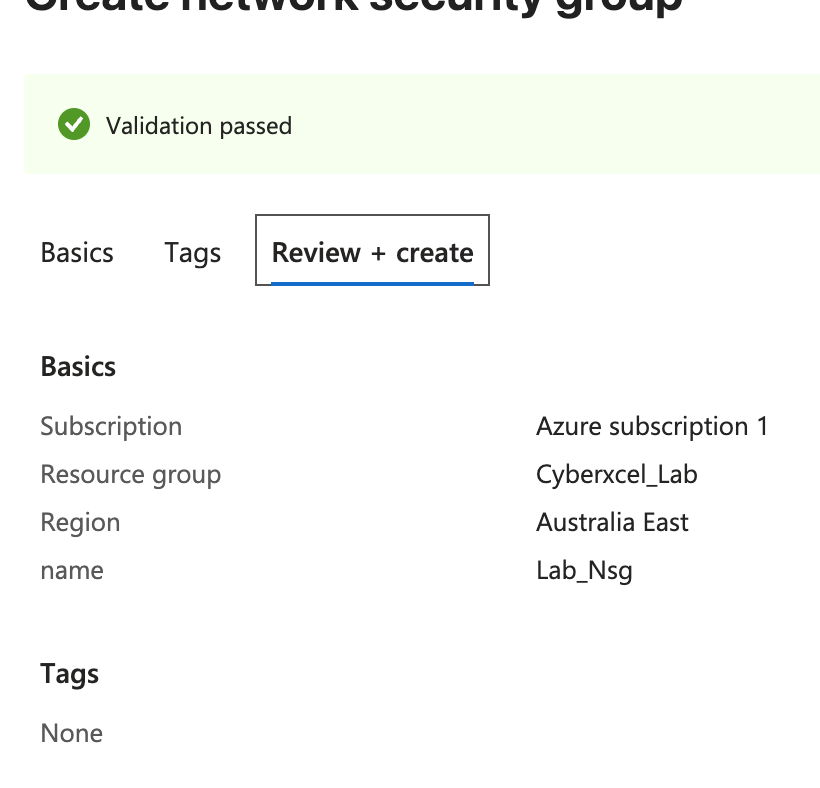
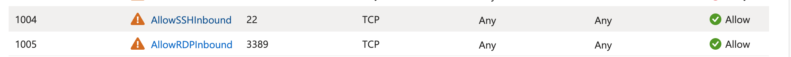

# Microsoft Sentinel SOC Lab — Build, Detection Engineering & Troubleshooting
 
A hands-on Security Operations Center (SOC) lab built manually in Azure, covering infrastructure deployment, log pipeline configuration, onboarding to Microsoft Defender and Microsoft Sentinel, and custom detection engineering. The lab includes a Windows 11 VM and an Ubuntu Linux VM, both feeding logs into a shared Log Analytics workspace, with analytics rules written to detect brute-force and credential-access activity across RDP, SSH, and Microsoft Entra ID sign-ins.
 
This project was built as part of self-directed SOC analyst skill development, and documents both the finished architecture and the real troubleshooting encountered along the way — including log pipeline debugging, RBAC issues, and network access control conflicts.
 
## Objectives
 
- Build a complete Sentinel-ready lab environment from the ground up, without relying on a pre-packaged Marketplace template.
- Configure both data-plane (Windows Event Logs, Syslog) and control-plane (Azure Activity, resource diagnostics, Entra ID sign-in) log collection.
- Onboard the environment to Microsoft Defender and Microsoft Sentinel and validate that logs are actually landing where expected.
- Write and tune custom KQL-based analytics rules to detect brute-force and suspicious sign-in activity.
- Practice systematic, layer-by-layer troubleshooting of a real log ingestion pipeline.
## Architecture
 
- 1 Resource Group containing all lab resources
- 1 Virtual Network with a defined address space and subnet
- 1 Network Security Group (intentionally permissive for lab purposes, then progressively hardened)
- 2 Virtual Machines: Windows 11 Pro and Ubuntu Pro 20.04 LTS
- 1 Log Analytics Workspace collecting data-plane logs (Windows Security Events, Syslog) and control-plane logs (Azure Activity, resource diagnostics, Entra ID sign-in)
- Microsoft Defender for Cloud and Microsoft Sentinel layered on top for detection, investigation, and response

 
## Prerequisites
 
- An Azure account with Pay-As-You-Go billing enabled (required for Microsoft Sentinel features).
- A budget alert configured to avoid unexpected charges: **Cost Management -> Budgets -> Add a budget**, with an alert threshold set at USD 150.
  
- A credit card on file (no charge beyond the free credit while a spending limit is enabled).
- A remote access client for each VM: Microsoft Remote Desktop ("Windows App" on macOS) for the Windows VM, and an SSH client for the Linux VM.
### Setting up an SSH client on macOS
 
macOS does not ship with PuTTY, and PuTTY has no official Mac build, so it was installed via Homebrew:
 
```bash
# Install Homebrew
/bin/bash -c "$(curl -fsSL https://raw.githubusercontent.com/Homebrew/install/HEAD/install.sh)"
 
# Add Homebrew to the shell's PATH permanently
echo 'eval "$(/opt/homebrew/bin/brew shellenv)"' >> ~/.zprofile
 
# Load it into the current session
eval "$(/opt/homebrew/bin/brew shellenv)"
 
# Confirm the install
brew --version
 
# Install PuTTY
brew install putty
```
 
## Part 1 — Building the Lab Infrastructure
 
### Step 1: Create the resource group
 
A single resource group was created to hold every lab resource, keeping the environment easy to manage and tear down later.
 

 

 
### Step 2: Create the virtual network
 
A virtual network was created in the deployer's home region, with an address space sized for the lab's two VMs.
 

 
### Step 3: Create the Network Security Group
 
A Network Security Group (NSG) was created in the same region and associated with the virtual network's subnet from the previous step. Inbound rules were then added to allow SSH (22) and RDP (3389) so the VMs could be reached remotely.
 

 

 

 
### Step 4: Create the Windows VM
 
A Windows 11 Pro VM was deployed with a minimum of 4 vCPUs and 16 GB RAM, on the virtual network created above.
 

 
### Step 5: Create the Linux VM
 
An Ubuntu Pro 20.04 LTS VM was deployed alongside the Windows VM.
 

 
### Step 6: Create the Log Analytics Workspace
 
A Log Analytics Workspace (LAW) was created in the same subscription and region as the rest of the lab.
 
### Step 7: Create Data Collection Rules (data-plane logs)
 
Two Data Collection Rules (DCRs) were created from **Log Analytics Workspace -> Classic -> Agents -> Data Collection Rules**, one for each VM:
 
- **Windows DCR** — resource: the Windows VM; data source: Windows Event Logs; destination: the Log Analytics Workspace.
- **Linux DCR** — resource: the Ubuntu VM; data source: Syslog; destination: the same Log Analytics Workspace.
These DCRs govern the data-plane logs collected from each VM. Both VMs need to be running, and ingestion can take up to 24 hours to fully appear after the first configuration.
 
### Step 8: Collect control-plane logs — Azure Activity
 
Azure Activity Logs were routed into the workspace via **Monitor -> Settings -> Diagnostic settings -> Add diagnostic setting**, selecting the relevant log categories.
 

 
### Step 9: Collect control-plane logs — NSG resource logs
 
Resource logs were also enabled, scoped to just the NSG (Windows and Linux VM logs were already being collected via the DCRs, so enabling resource-level logs for the VMs again was unnecessary): **Monitor -> Diagnostic settings -> [Lab NSG] -> Add diagnostic setting**, with all log category groups selected.
 
### Step 10: Collect Microsoft Entra ID sign-in logs
 
Sign-in logs were routed into the same workspace via **Microsoft Entra ID -> Monitoring -> Diagnostic settings -> Add diagnostic setting**, selecting all log categories and sending them to the Log Analytics Workspace.
 
### Step 11: Verify log ingestion
 
Four log sources were verified directly in the workspace's **Logs** blade using KQL, both by browsing the Tables list and by running queries. Entra ID sign-in logs took roughly two days to fully ingest, so the query time range was extended to the last 7 days while validating:
 
```kql
// Entra ID sign-in logs
SigninLogs
| take 10
```
 
```kql
// Azure Activity logs
AzureActivity
| take 10
```
 
```kql
// Resource logs (NSG diagnostics land in AzureDiagnostics)
AzureDiagnostics
| summarize count() by Category
```
 
```kql
// Linux data-plane logs
Syslog
| take 10
```
 
```kql
// Windows data-plane logs
SecurityEvent
| where EventLog contains "Security"
```
 
## Part 2 — Onboarding to Microsoft Defender and Sentinel
 
### Step 1: Enable Microsoft Defender for Cloud
 
From **Microsoft Defender for Cloud -> Environment settings -> [subscription]**, the relevant Defender plans were enabled.
 

 

 
Defender and Sentinel have both moved to a unified portal at `security.microsoft.com`. Signing in with an Azure account that uses an external email provider (Gmail, Outlook/Live, etc.) can trigger a sign-in error at that URL:
 

 
**Fix:** append the tenant ID directly to the URL — `security.microsoft.com/?tid=<tenant-id>` — using the tenant ID found under **Microsoft Entra ID -> Overview -> Tenant properties**.
 
### Step 2: Enable Microsoft Sentinel
 
Microsoft Sentinel was added from the Azure Portal and pointed at the Log Analytics Workspace created earlier.
 
### Step 3: Troubleshooting — no data in the Defender portal
 
After enabling Sentinel, the Defender portal showed no data for roughly a day, despite the underlying workspace containing real log data.
 

 
**Fix — assign the Microsoft Sentinel Contributor role explicitly:**
 
1. Go to **Resource groups** and open the lab's resource group.
2. Select **Access control (IAM)** from the left-hand menu.
3. Select **+ Add -> Add role assignment**.
4. Search for and select **Microsoft Sentinel Contributor** (this grants full working access to Sentinel, rather than read-only access).
5. Select **Next**.
6. Leave the assignment scoped to **User, group, or service principal**, then select **+ Select members**.
7. Search for and select the account being used to sign in.
8. Select **Select**, then **Review + assign**, then **Assign** to confirm.
Combined with waiting roughly a day for the role change to propagate, this resolved the empty-portal issue.
 
### Step 4: Configure data connectors
 
Data connectors control which log sources are actually visible inside Sentinel. Several were installed from **Content management -> Content hub**, and it took some time for each to fully onboard:
 
- Azure Activity
- Microsoft Defender for Cloud
- Microsoft Defender XDR
- Microsoft Defender for Identity
- Microsoft Defender for Office 365
- Microsoft Defender for Endpoint
- Microsoft Entra ID
- Network Session Essentials
- SOC Handbook
- Threat Intelligence
- VirusTotal
- Windows Security Events
- Syslog
- UEBA (User and Entity Behavior Analytics)
- Azure NSG Analytics
Even with a Windows DCR already configured directly in the Azure Portal, Windows Security Events did not initially appear in the Defender portal. Re-creating the Data Collection Rule from inside the **Windows Security Events** data connector page itself (rather than from the Log Analytics Workspace blade), and enabling UEBA, resolved this.
 

 
### Step 5: Onboard the Windows VM to Defender for Endpoint
 
The Microsoft Defender for Endpoint onboarding package was downloaded from the Defender portal and installed on the Windows VM.
 
### Step 6: KQL practice
 
A set of exercises were used to build familiarity with querying `SecurityEvent` data:
 
```kql
// Find all security events from the last 7 days with Event ID 4625 (failed logon)
SecurityEvent
| where TimeGenerated > ago(7d)
| where EventID == 4625
```
 
```kql
// Top 5 accounts with the most failed login attempts in the last week
SecurityEvent
| where TimeGenerated > ago(7d)
| where EventID == 4625
| summarize FailedAttempts = count() by Account
| top 5 by FailedAttempts
```
 
```kql
// Security events per hour for the last 24 hours
SecurityEvent
| where TimeGenerated > ago(24h)
| extend Hour = hourofday(TimeGenerated)
| summarize Events = count() by Hour
```
 
```kql
// Processes started via cmd.exe or powershell.exe in the last day
SecurityEvent
| where TimeGenerated > ago(1d)
| where EventID == 4688
| where CommandLine startswith "cmd.exe" or CommandLine startswith "powershell.exe"
| project TimeGenerated, Computer, Account, NewProcessName, CommandLine, ParentProcessName
| order by TimeGenerated desc
```
 
```kql
// Successful logons (4624) from more than 3 distinct IP addresses in 24 hours
SecurityEvent
| where TimeGenerated > ago(24h)
| where EventID == 4624
| where isnotempty(IpAddress)
| summarize UniqueIPCount = dcount(IpAddress), IPList = make_set(IpAddress) by Account
| where UniqueIPCount > 3
| order by UniqueIPCount desc
```
 
### Step 7: Troubleshooting — SSH access blocked
 
With the Syslog data connector connected and an analytics rule in place, no Linux logs were visible in Sentinel, and SSH access to the Linux VM stopped working. This turned out to be two separate issues, covered in the Troubleshooting Deep Dive and SSH / Just-in-Time access sections below.
 
## Part 3 — Detection Engineering
 
Three custom analytics rules were built to detect brute-force and credential-access activity across the lab's RDP, SSH, and Entra ID sign-in surfaces.
 
### RDP — multiple failed login attempts
 
**Threat overview:** attackers targeting the Windows VM via Remote Desktop Protocol. Event ID 4625 indicates a failed interactive logon; Logon Type 10 indicates a RemoteInteractive (RDP) session.
 
```kql
SecurityEvent
| where TimeGenerated > ago(10m)
| where EventID == 4625            // Failed logon
| where LogonType == 10            // RemoteInteractive (RDP)
| extend SourceIP = IpAddress
| extend TargetAccount = TargetUserName
| where isnotempty(SourceIP) and SourceIP != "-"
| where TargetAccount !endswith "$"   // Exclude computer accounts
| summarize
    FailedAttempts = count(),
    AccountsTargeted = dcount(TargetAccount),
    AccountList = make_set(TargetAccount, 10),
    FirstAttempt = min(TimeGenerated),
    LastAttempt = max(TimeGenerated)
    by SourceIP, Computer
| where FailedAttempts >= 5
| extend ThreatSeverity = case(
    FailedAttempts >= 20, "Critical - Active Attack",
    FailedAttempts >= 10, "High - Possible Brute Force",
    "Medium - Monitor"
  )
| project FirstAttempt, LastAttempt, AttackerIP = SourceIP, TargetComputer = Computer,
    FailedAttempts, AccountsTargeted, AccountList, ThreatSeverity
```
 
**Rule configuration:** Severity High, runs every 5 minutes, looks back 10 minutes, alert threshold > 0 results, grouped by source IP, 30-minute suppression.
 
**Entity mapping:** IP -> AttackerIP, Host -> TargetComputer.
 
**MITRE ATT&CK:** Credential Access — T1110.001 (Brute Force: Password Guessing).
 
**Tuning tips:** correlate with a subsequent successful logon (4624); allow-list known jump/bastion hosts; flag logons from unexpected geographies; alert separately on privileged-account targeting.
 
A companion hunting query for the RDP surface, including basic geo-enrichment:
 
```kql
SecurityEvent
| where TimeGenerated > ago(1d)
| where EventID == 4625
| where isnotempty(IpAddress)
| summarize FailedAttempts = count() by IpAddress, Computer, TargetUserName
| where FailedAttempts >= 5
| extend Geo = geo_info_from_ip_address(IpAddress)
| extend Country = Geo.country
```
 
### SSH — brute-force attack on Linux
 
```kql
Syslog
| where TimeGenerated > ago(10m)
| where Facility == "auth" and SeverityLevel == "info"
| where SyslogMessage has "Failed Password"
| extend SourceIP = extract(@"from\s+(\S+)", 1, SyslogMessage)
| summarize FailedAttempts = count() by SourceIP, Computer, HostIP
| where FailedAttempts >= 5
```
 
**Rule configuration:** Name: *SSH Brute Force Attack on Linux*, Severity Medium, runs every 5 minutes, looks back 10 minutes, alert threshold > 0 results, single alert per grouping, incidents enabled with alert grouping (match all entities), 5-hour grouping window.
 
**Entity mapping:** Host -> Computer, IP -> HostIP, IP -> SourceIP.
 
**MITRE ATT&CK:** Credential Access — T1110.001 (Brute Force: Password Guessing).
 
### Microsoft Entra ID — multiple failed sign-ins
 
**Threat overview:** repeated failed Entra ID sign-ins can indicate compromised credentials, phishing victims, or automated attacks against cloud accounts.
 
```kql
SigninLogs
| where TimeGenerated > ago(10m)
| where ResultType != "0"   // 0 = success, anything else = failure
| where ResultType in ("50126", "50053", "50055", "50057", "50072", "50074")
    // 50126: Invalid username or password   50053: Account locked
    // 50055: Expired password               50057: Account disabled
    // 50072 / 50074: MFA required but not provided
| extend FailureReason = case(
    ResultType == "50126", "Invalid credentials",
    ResultType == "50053", "Account locked",
    ResultType == "50055", "Expired password",
    ResultType == "50057", "Account disabled",
    ResultType in ("50072", "50074"), "MFA failure",
    "Other failure"
  )
| summarize
    FailedSignIns = count(),
    FailureReasons = make_set(FailureReason),
    FirstFailure = min(TimeGenerated),
    LastFailure = max(TimeGenerated),
    Locations = make_set(Location, 5),
    Apps = make_set(AppDisplayName, 5)
    by UserPrincipalName, IPAddress
| where FailedSignIns >= 5
| extend RiskLevel = case(
    FailedSignIns >= 20, "Critical",
    FailedSignIns >= 10, "High",
    "Medium"
  )
| project FirstFailure, LastFailure, User = UserPrincipalName, SourceIP = IPAddress,
    FailedSignIns, FailureReasons, Locations, AppsAccessed = Apps, RiskLevel
```
 
**Rule configuration:** Severity High, runs every 5 minutes, looks back 10 minutes, alert threshold > 0 results, grouped by user and source IP, 30-minute suppression.
 
**Entity mapping:** Account -> User, IP -> SourceIP.
 
**MITRE ATT&CK:** Credential Access — T1110.001 (Brute Force: Password Guessing).
 
> A dedicated test account was created in Entra ID to safely generate failed sign-in events for this rule. Its credentials are intentionally omitted here — real usernames and passwords should never be committed to a public repository, even for a disposable lab account.
 
**Bonus detection — impossible travel:**
 
```kql
// Flags a successful sign-in that follows a prior successful sign-in
// from a different location within an implausibly short window.
SigninLogs
| where TimeGenerated > ago(6h)
| where ResultType == "0"   // Successful sign-ins only
| project TimeGenerated, UserPrincipalName, IPAddress, Location
| serialize
| extend PrevLocation = prev(Location, 1)
| extend PrevTime = prev(TimeGenerated, 1)
| extend PrevUser = prev(UserPrincipalName, 1)
| where UserPrincipalName == PrevUser
| where Location != PrevLocation
| extend TimeDiffMinutes = datetime_diff('minute', TimeGenerated, PrevTime)
| where TimeDiffMinutes < 60 and TimeDiffMinutes > 0
| where isnotempty(Location) and isnotempty(PrevLocation)
| project User = UserPrincipalName, FirstLocation = PrevLocation, FirstTime = PrevTime,
    SecondLocation = Location, SecondTime = TimeGenerated, MinutesBetween = TimeDiffMinutes
```
 
**Tuning tips:** combine with a subsequent successful sign-in for compromise confirmation; watch for sign-ins via Tor exit nodes or consumer VPN ranges; cross-reference with Entra ID Identity Protection risk scores; alert separately on privileged (Global Admin) accounts.
 
## Troubleshooting Deep Dive — Linux Syslog Ingestion
 
With the Syslog data connector connected and an analytics rule in place, no Linux logs were appearing in Sentinel. Every individual pipeline component looked healthy in isolation, and the root cause only emerged by walking the full path layer by layer.
 
| # | Layer checked | Symptom | Finding |
|---|---|---|---|
| 1 | rsyslog -> AMA local listener (port 28330) | rsyslog logs showed connection refused on 127.0.0.1:28330 | Transient boot-time race condition — rsyslog started a few seconds before the Azure Monitor Agent (mdsd) finished initializing. rsyslog's own retry logic self-healed within 5 seconds. |
| 2 | AMA process health | Checked systemctl status and the listening port | Agent process and listener both healthy. |
| 3 | Managed identity / authentication | Checked agent logs for auth failures | None found — the system-assigned managed identity was correctly enabled, ruling out an authentication failure. |
| 4 | Data Collection Rule (DCR) association | The Portal's DCR "Resources" tab showed the VM listed | Misleading — this reflects a UI selection, not necessarily a persisted association. |
| 5 | Ground-truth verification via Azure CLI | Checked DCR association directly via CLI | Confirmed the VM *was* associated with a DCR — but not the one being edited through the Sentinel data connector wizard. It was pointing at a leftover DCR from an earlier, separate setup attempt. |
| 6 | Inspecting the actual active DCR via CLI | Two compounding misconfigurations found at once | (a) The DCR's destination pointed at a different Log Analytics workspace than the one being queried. (b) Its Syslog data source was configured to collect only two facilities at Alert/Emergency severity — everything else, including every test message, was silently filtered before it ever left the VM. |
 
**Fix:** the correct DCR's data source was edited to broaden facility and severity coverage (collecting from Debug level upward on the relevant facilities), the destination workspace was confirmed to match the one being queried, the Azure Monitor Agent was restarted, and the fix was verified end-to-end with a test message traced through to a KQL query.
 
### SSH access blocked by Just-in-Time VM access
 
SSH access to the Linux VM also stopped working. Inspecting the VM's NSG inbound rules showed a Microsoft Defender for Cloud Just-in-Time (JIT) VM access rule (priority 1000, Deny) sitting ahead of the manually created AllowSSHInbound rule (priority 1001). NSG rules evaluate in ascending priority order on a first-match basis, so the lower-priority-number Deny rule always won.
 
**Fix:** requested temporary JIT access to restore SSH immediately, then disabled JIT management on the VM entirely (Defender for Cloud -> Workload protections -> Just-in-time VM access) for a friction-free lab environment, since JIT grants are time-limited and otherwise need to be re-requested every session.
 
Once Syslog data was flowing correctly, it was used for SSH brute-force hunting:
 
```kql
Syslog
| where TimeGenerated > ago(1h)
| where Facility == "auth" and SeverityLevel == "info"
| where SyslogMessage has "Failed Password"
| extend SourceIP = extract(@"from\s+(\S+)", 1, SyslogMessage)
| summarize FailedAttempts = count() by SourceIP, Computer, HostIP
| where FailedAttempts >= 5
```
 
## Skills Demonstrated
 
- Azure infrastructure fundamentals — resource groups, virtual networks, NSGs, and VM deployment built manually rather than from a template.
- Microsoft Sentinel & Log Analytics — workspace design, Data Collection Rules, analytics rules, KQL querying.
- Microsoft Defender unified security operations platform — workspace onboarding, tenant-scoped sign-in workarounds, RBAC-driven data visibility.
- Azure Monitor Agent & Data Collection Rules — real-time log ingestion pipeline design and multi-layer debugging.
- Azure networking & security — NSG rule priority and evaluation order, Just-in-Time VM access.
- Azure RBAC — role assignment scoping and its effect on Defender portal data visibility.
- Detection engineering — writing, tuning, and entity-mapping custom KQL analytics rules against MITRE ATT&CK techniques.
- Azure CLI as a ground-truth diagnostic tool when the Portal UI's displayed state didn't match backend reality.
- Systematic troubleshooting methodology — isolating variables layer by layer (network, identity, configuration, data) rather than guessing.
## Key Takeaways
 
- Portal UI state isn't always authoritative — the Azure CLI was repeatedly the deciding factor in confirming what was actually configured versus what the Portal merely displayed.
- Silent data drops (a facility/severity filter, a wrong destination workspace) produce zero errors anywhere in the stack — the only way to catch them is to verify data at each hop rather than assuming "no error" means "working."
- NSG evaluation order (lowest priority number wins) is a common source of "my rule should allow this" confusion — always check for auto-generated rules, such as JIT, sitting ahead of manual ones.
- RBAC scope matters even when a broader role (like subscription-level Owner) is technically in place — an explicit, resource-group-scoped role assignment resolved a data-visibility issue that Owner access alone did not.
---
 
*Screenshots referenced above are stored alongside this README in this same folder.*
 
